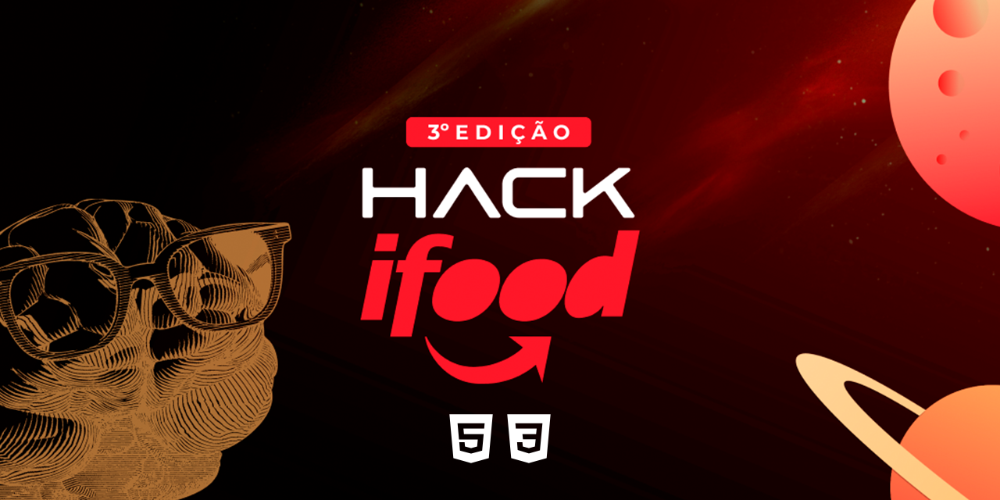

<div align="center" id="top">
  
[🇧🇷 Português](./README.md) | [🇺🇸 English](./README_EN.md) | [🇪🇸 Español](./README_ES.md)

</div>

# Hack Ifood - 3ª Edição

<div align="center">



[Ver Demonstração](https://ifood-receitas.surge.sh)


</div>

## 📖 Índice

<div align="center">
    <a href="#-sobre-o-projeto">Sobre o Projeto</a> | 
    <a href="#-funcionalidades">Funcionalidades</a> | 
    <a href="#-tecnologias">Tecnologias</a> | 
    <a href="#-instalação-e-uso">Instalação e Uso</a> | 
    <a href="#-licença">Licença</a> | 
    <a href="#-participantes">Participantes</a> | 
</div>

## 📘 Sobre o Projeto

Para apaixonados por gastronomia e apreciadores de boas receitas, que precisam de um acesso rápido a ingredientes de qualidade e melhor preço, o iFood Receitas é um produto, que pode ser aplicado dentro do ecossistema do iFood ou em qualquer outro lugar, que proporciona uma jornada de compra mais rápida, incluindo todos os ingredientes de uma receita ao carrinho com apenas 1 clique. Diferentemente de outros aplicativos, o iFood Receitas torna a experiência de compra mais prazerosa, rápida e com os melhores preços dos mercados. [Assista nosso Pitch](https://www.youtube.com/watch?v=eWLXuaZF-ho).

## 🚀 Funcionalidades

- O código da interface do ifood produzida nas linguagens HTML, CSS e JS;
- Lógica de animação das telas e slides;
- Nova função desenvolvida pelo time chamada "Receitas";
- Caminhos para chegar aos pedidos e compra.

## 🛠 Tecnologias

Durante o projeto, para prototipação e simulação da ideia foram utilizadas:

- HTML
- CSS
- JavaScript
- SwiperJS

#### Futuro:

- ReactJS
- React Native
- NodeJS/Python
- AI (IBM Watson/Google Duplex) - Fazer análise da receita e comparar com o catálogo dos supermercados/restaurantes indicando a melhor opção com base nos gostos do consumidor.
- Crawler - Fará a indexação das receitas via web.
- Fornecer uma API que conectará os serviços aos nossos servidores podendo assim atender diversos players e soluções.

## 🚀 Instalação e Uso

```bash
# Clone este repositório:
$ git clone https://github.com/thiilins/hackaton-ifood

# Entre na pasta:
$ cd hackaton-ifood
# Iniciar o live server:
# O app vai inicializar em <http://localhost:5500>
```

## 📜 Licença

Este projeto está sob a licença MIT. Consulte o arquivo [LICENSE](./LICENSE) para obter mais detalhes.

## 🤝 Participantes

- [Pedro Lucas Lopes Paraguai](https://github.com/PedroLucasLopes)
- [Thiago Lins](https://github.com/thiilins)
- [Eloísa Schwertner](https://www.linkedin.com/in/eloisa-schwertner/)
- [Luadyna Almeida](https://www.linkedin.com/in/luadyna-almeida/)
- Bruna Lopes

Feito com ❤️ por [Thiago Lins](https://github.com/thiilins).
<p align="right">(<a href="#top">Voltar para o topo</a>)</p>
