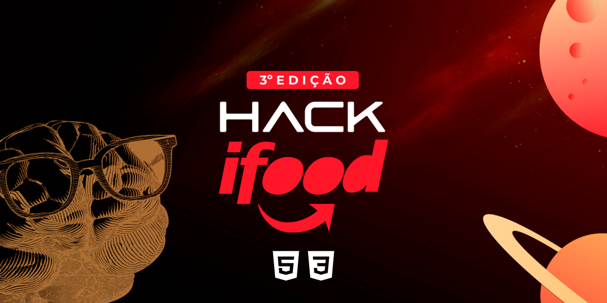

<div align="center" id="top">
  
[🇧🇷 Português](./README.md) | [🇺🇸 English](./README_EN.md) | [🇪🇸 Español](./README_ES.md)

</div>

# Hack Ifood - 3rd Edition

<div align="center">



[View Demo](https://ifood-receitas.surge.sh)


</div>

## 📖 Table of Contents

<div align="center">
    <a href="#-about-the-project">About the Project</a> | 
    <a href="#-features">Features</a> | 
    <a href="#-technologies">Technologies</a> | 
    <a href="#-installation-and-use">Installation and Use</a> | 
    <a href="#-license">License</a> | 
    <a href="#-participants">Participants</a> | 
</div>


## 📘 About the Project

For those passionate about gastronomy and fans of good recipes, who need quick access to quality ingredients at the best price, iFood Recipes is a product that can be applied within the iFood ecosystem or elsewhere. It provides a quicker shopping journey, adding all the ingredients of a recipe to the cart with just one click. Unlike other apps, iFood Recipes makes the shopping experience more enjoyable, faster, and with the best market prices. [Watch our Pitch](https://www.youtube.com/watch?v=eWLXuaZF-ho).

## 🚀 Features

- Interface code of iFood developed in HTML, CSS, and JS;
- Screen and slide animation logic;
- New feature developed by the team called "Recipes";
- Paths to reach orders and purchase.

## 🛠 Technologies

During the project, for prototyping and idea simulation, the following technologies were used:

- HTML
- CSS
- JavaScript
- SwiperJS

#### Future:

- ReactJS
- React Native
- NodeJS/Python
- AI (IBM Watson/Google Duplex) - Analyze the recipe and compare it with the supermarket/restaurant catalog, suggesting the best option based on consumer preferences.
- Crawler - Will index the recipes via web.
- Provide an API that will connect services to our servers, thus serving various players and solutions.

## 🚀 Installation and Use

```bash
# Clone this repository:
$ git clone https://github.com/thiilins/hack_ifood

# Navigate to the folder:
$ cd hack_ifood
# Start the live server:
# The app will initialize at <http://localhost:5500>
```

## 📜 License

This project is under the MIT License. See the [LICENSE](./LICENSE) file for more details.

## 🤝 Participants

- [Pedro Lucas Lopes Paraguai](https://github.com/PedroLucasLopes)
- [Thiago Lins](https://github.com/thiilins)
- [Eloísa Schwertner](https://www.linkedin.com/in/eloisa-schwertner/)
- [Luadyna Almeida](https://www.linkedin.com/in/luadyna-almeida/)
- Bruna Lopes

Made with ❤️ by [Thiago Lins](https://github.com/thiilins).
<p align="right">(<a href="#top">Back to top</a>)</p>
